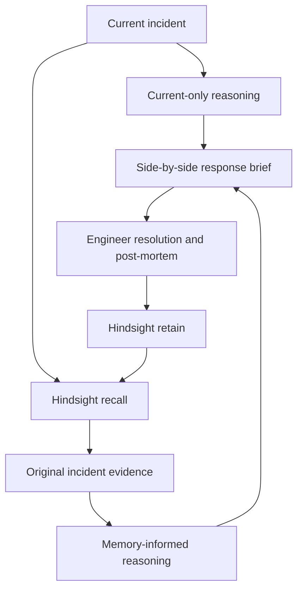

# IncidentMind

**Every incident becomes knowledge for the next incident.**

IncidentMind remembers how an organization solved previous incidents and uses that
experience to guide the next response. It is a focused Python/Streamlit prototype
for SREs, not a monitoring platform or infrastructure automation system.

## Status

Implemented: incident intake, Hindsight adapter, evidence-grounded recommendation
flow, before/after comparison, post-mortem learning, memory inspection, history,
dashboard, seed data and guided demo. Local tests and Streamlit startup have been
run; see `docs/verification.md` for the actual results.

**Live Hindsight + LLM acceptance remains unverified in the build environment:**
no provider configuration was supplied. The app never substitutes local sample
data for Hindsight or pretends a failed provider call succeeded. Configure both
providers and run the live acceptance test before calling the demo production- or
hackathon-ready. The brief supplied no GitHub repository URL, so no push occurred.

## Problem and solution

During an outage, engineers repeatedly rediscover root causes, retry ineffective
fixes and search scattered post-mortems. IncidentMind retrieves previous symptoms,
actual outcomes, failed approaches and runbooks, then uses them to prioritize the
current response. The engineer's confirmed resolution becomes the next memory.

## Why Hindsight is central

`src/memory/hindsight_memory.py` is the only persistent memory implementation.
It uses the official `hindsight-client==0.10.2` SDK:

- `aretain`: store a typed outcome/post-mortem as a source document, with the
  incident ID as `document_id`, service metadata and the `incidentmind-v1` tag.
  Synchronous completion (`retain_async=False`) is required before success.
- `arecall`: search errors, symptoms, service, logs and deployment context across
  the configured organization's bank. Only tagged incident facts are eligible.
- `documents.get_document`: hydrate recalled document IDs into complete source
  incidents so historical sections display original records, not model inventions.
- `documents.list_documents`: read paginated incident history and dashboard data.

Reusing a document ID allows a failed/uncertain save to be retried without creating
a new logical incident. A fresh SDK client is opened and closed inside each async
operation. No local JSON, SQLite database or dictionary serves as agent memory.
The session dictionary stores active UI drafts only and is never used for recall.
Hindsight performs its own extraction/retrieval; the app uses a separate configured
LLM for diagnosis and advice. Hindsight `reflect` is not used or required here.

SDK references verified during development:
[Python SDK](https://hindsight.vectorize.io/sdks/python),
[Documents](https://hindsight.vectorize.io/developer/api/documents).

## Architecture



See `docs/architecture.md` for data boundaries, error behavior and code ownership.

## Features

- Validated incident form: service, severity, description, error, symptoms, logs
  and recent change. IDs and UTC timestamps are generated automatically.
- Two genuine model contexts: current-only baseline and memory-informed response.
- Confirmed historical root causes, successful resolutions, failed approaches,
  recorded runbooks and post-mortem lessons displayed from retrieved source data.
- Exact source-quote and incident-ID validation before rendering recommendations.
- Empty-memory notice; retrieval failure is a distinct error, never an empty result.
- Post-mortem with actual cause, attempted steps, failed fixes, runbook, outcome,
  elapsed minutes and prevention learning. Failed writes preserve the form/draft.
- Six views: Dashboard, New Incident, Incidents, Memory, Post-Mortem and Demo.
- Explicit import of 20 synthetic incidents across five services and nine runbook
  categories, including misleadingly similar symptoms and nonresolved outcomes.
- One-click demo incident load, future-incident load and visible recall verification.
- No infrastructure commands are executed. Engineers decide and act.

## Installation

Use Python **3.12**. From the extracted project's parent directory:

```bash
cd IncidentMind
python -m venv .venv
source .venv/bin/activate
python -m pip install -r requirements-dev.txt
cp .env.example .env
```

On Windows PowerShell, activation/copy commands are:

```powershell
.\.venv\Scripts\Activate.ps1
Copy-Item .env.example .env
```

Edit `.env` with your own values. Do not commit it.

| Variable | Purpose |
| --- | --- |
| `HINDSIGHT_BASE_URL` | Existing Hindsight service URL; HTTPS outside localhost |
| `HINDSIGHT_API_KEY` | Hindsight bearer token for that service |
| `HINDSIGHT_BANK_ID` | Dedicated organization/demo bank; default `incidentmind-demo` |
| `HINDSIGHT_ALLOW_UNAUTHENTICATED` | Set `true` only for a trusted localhost server without auth |
| `LLM_API_KEY` | Credential for the app's reasoning provider |
| `LLM_BASE_URL` | OpenAI-compatible endpoint; defaults to `https://api.openai.com/v1` |
| `LLM_MODEL` | Your available chat-completions model with JSON-object output support |
| `REQUEST_TIMEOUT_SECONDS` | Per-request timeout, default 120, allowed range 1–600 |

Hindsight must already be running with its own extraction/embedding/model setup,
or use [Hindsight Cloud](https://ui.hindsight.vectorize.io). Installing the client
package alone does not start a memory server. App LLM configuration does not
configure the Hindsight server's model. Do not put keys in command-line arguments.

## Seed and run

```bash
python -m scripts.seed
python -m streamlit run app.py
```

Open `http://localhost:8501`. Alternatively, import the historical incidents using
**Demo → Setup → Seed 20 historical incidents**. Seeding is real and may take
minutes or consume provider credits. Re-import uses the same 20 source IDs.
Use a dedicated demo bank, separate from real operational records.

For runtime-only dependencies, use `python -m pip install -r requirements.txt`.
The application opens without keys and shows configuration guidance; analysis,
recall and learning require working providers.

## Example / before versus after

Load the demo or enter:

- Service: `payment-api`; severity: `SEV-1`
- Error: `Timeout acquiring database connection`
- Symptoms: increasing HTTP 503; exhausted database connection pool
- Recent change: `v2.8.4` deployed ten minutes ago

The left panel receives only these current facts. The right panel additionally
receives real recalled records. Seed records include connection leaks after
releases, pool exhaustion from an importer, and blocked transactions: the model
must consider the mechanism rather than assume every pool problem is a leak.
Historical sections display what was recorded, while current diagnoses remain
hypotheses. The exact response is model-generated, not a prewritten demo answer.

## Learning loop

Incident → Hindsight recall → evidence-informed recommendation → engineer's
resolution → actual post-mortem → Hindsight retain → a similar future incident.

1. Analyze an incident and expand its historical evidence.
2. Perform the simulated demo resolution or your actual approved resolution.
3. Enter the real outcome under **Post-Mortem** and save it.
4. Wait for **Memory Updated**. A failed/uncertain write never displays that success.
5. Under **Demo**, load a similar future incident and analyze it.
6. Return to Demo. It reports verified only when the newly stored incident is
   recalled **and cited** in the new recommendation. Source inspection alone is
   not counted as semantic-recall proof.

Presentation script: `docs/demo.md`.

## Tests

```bash
python -m pytest -q
```

Ordinary tests use SDK response models and explicitly mocked providers. They do
not establish real semantic memory quality. They cover models, configuration,
SDK call arguments, storage acknowledgements, retrieval, errors, source validation,
agent orchestration, Streamlit interactions and real local HTTP startup.

Opt into the separate **real** acceptance test after configuring `.env`:

```bash
RUN_LIVE_TESTS=1 python -m pytest -m live -v -s
```

PowerShell equivalent:

```powershell
$env:RUN_LIVE_TESTS="1"
python -m pytest -m live -v -s
Remove-Item Env:RUN_LIVE_TESTS
```

This creates a unique `incidentmind-test-*` bank, imports all 20 records, analyzes
Incident A, stores its resolution, uses a fresh client to recall Incident B, and
asserts that A is cited with its new learning. It prints and leaves the test bank
for inspection. Provider calls may cost money. The test fails if real retrieval or
memory influence is missing; it does not silently fall back to a fixture.

## Repository and handoff

The supplied brief's repository field was empty. A local Git repository was
initialized with a meaningful commit; no remote was invented and nothing was
pushed. `git rev-parse HEAD` and `git status --short` show the current state.

The handoff archive includes `IncidentMind.git.bundle` and a `HANDOFF.txt` manifest.
To restore committed history from the archive's parent directory:

```bash
git clone IncidentMind.git.bundle IncidentMind-repo
cd IncidentMind-repo
git log -1 --oneline
```

Once the team supplies the intended repository URL, connect that remote and push
normally; inspect any existing remote work first. Do not force-push.

## Genuine limitations

- Real Hindsight retention/recall and real LLM output were not tested without
  credentials. The live acceptance gate remains open.
- No GitHub URL/access was provided, so there is no confirmed GitHub location.
- Single-organization prototype; no user login, RBAC, concurrent-edit control or
  tenant isolation beyond choosing a separate Hindsight bank.
- Active drafts, cached analysis and UI overview are session-only. Confirmed
  outcomes persist in Hindsight; refreshing/restarting can lose unsaved work.
- At most six distinct recalled source documents reach the model. Relevance is
  selected by the LLM; retrieval quality depends on Hindsight indexing/configuration.
- Exact quote/ID checks stop fabricated citations, but cannot prove every piece
  of model reasoning is correct. Human review remains necessary.
- Inputs can contain sensitive logs. The UI asks users to remove secrets; it does
  not implement an automatic, comprehensive redaction pipeline.
- Provider latency may exceed a 60-second demo. Prepare/seed beforehand. No claimed
  MTTR improvement or benchmark is presented.
- The overview summarizes up to 20 recent records and labels that scope. It is
  not an all-time monitoring/analytics system.

## Focused future work

After live acceptance: add durable incident drafts, team authentication, outcome
revision history, and a retrieval-quality evaluation set. Keep the product centered
on organizational incident memory.
